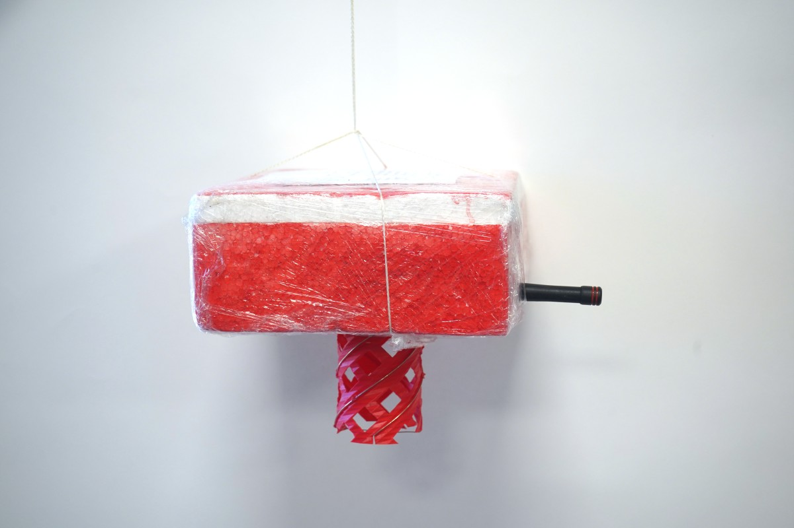
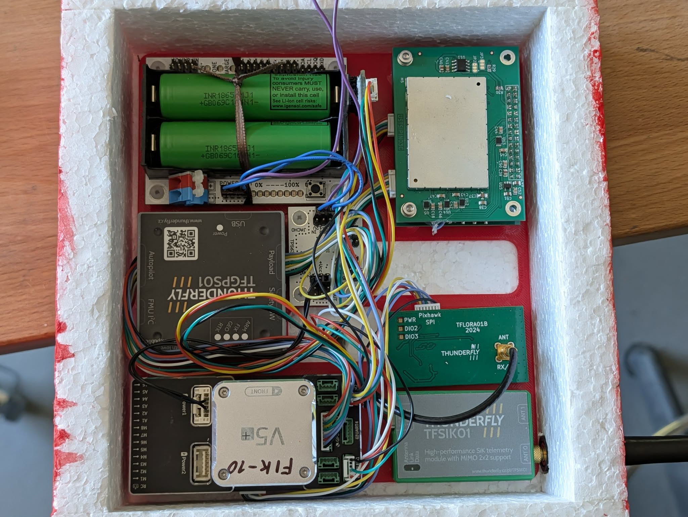
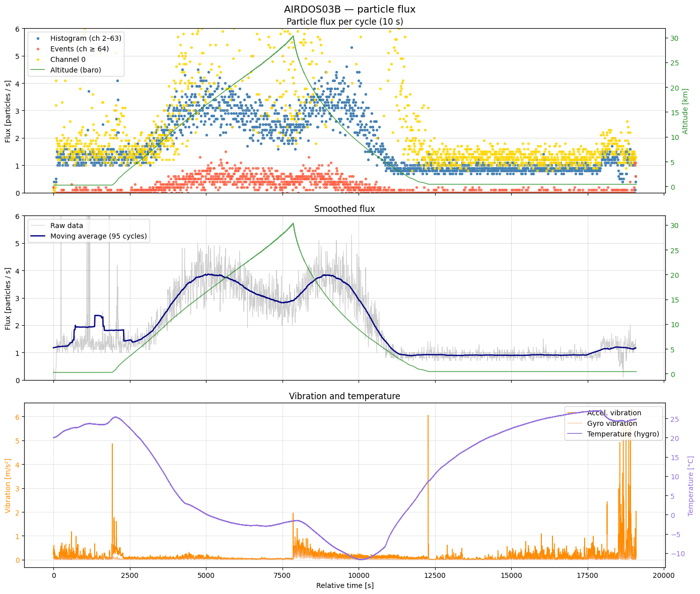

# FIK-10 - stratospheric balloon experiment

Repozitář odkazující na použitý HW a SW v rámci letu Fik-10, 28.4.2026. Let měl otestovat použitelnost PX4 based autopilotat v kombinaci s detektorem kosmického záření [AIRDOS03](https://docs.thunderfly.cz/avionics/AIRDOS03/).



## Technical description



### HW konfigurace

Založeno na PX4 subsystému [TF-B1](https://docs.thunderfly.cz/instruments/TF-B1). Final gondola mass: 534g (measured after the flight)

  - [CUAV 5+](https://docs.px4.io/main/en/flight_controller/cuav_v5_plus) (Autopilot FMU)
  - [TFLoRA01](https://docs.thunderfly.cz/avionics/TFLORA01/) (připojena do SPI autopilota)
  - [TFSIK01](https://docs.thunderfly.cz/avionics/TFLORA01/) (připojeno do Telem1 portu autopilota)
  - [UNIPAYLOAD01](https://docs.thunderfly.cz/avionics/TFUNIPAYLOAD01/) s [AIRDOS03](https://docs.dos.ust.cz/airdos/AIRDOS03) (připojeno do Telem2, a propojeno s TFGPS01 přes TFPayload connector)
  - [TFGPS01](https://docs.thunderfly.cz/avionics/TFGPS01/) (připojeno do primárního GPS portu autopilota)
  - Napájení z 2 článkového MLAB modulu [LION2CELL01](https://www.mlab.cz/module/LION2CELL01/) přes měnič [TPS63060V01](https://www.mlab.cz/module/TPS63060V01/) na 5V. 

### SW konfigurace

#### PX4

  - úprava firmware tak, aby přeposílání běželo ikdyž na druhé straně linky není heatbeat
  - `SER_TEL1_BAUD = 9600 8N1`

```
 `MAV_0_CONFIG = TELEM 1`
 `MAV_0_FORWARD = Enable`
 `MAV_0_RADIO_CTL = Enable`
 `MAV_0_MODE = Minimal`
 `MAV_0_RATE = 0`
 `SER_TEL2_BAUD = 115200 8N1`
 `MAV_1_CONFIG = TELEM 2`
 `MAV_1_MODE = Normal`
 `MAV_1_FORWARD = Enable`
 `MAV_1_RADIO_CTL = Disable`
 `SDLOG_PROFILE = 1041`
 `SDLOG_MODE = from boot until shutdown`
```

TODO: Přidat konfiguraci LoRA...

#### Sik

Nastavení skripty přiloženými v [repozitáři ve složce skripts](https://github.com/ThunderFly-aerospace/SiK/tree/226d3f2c34546ddb9b1f5473599bf921491b5561/scripts).

  - AIRSPEED 2
  - Balon BAUD 9600
  - GCS BAUD 57600

#### AIRDOS03

  - FW vysílá každých 10 sekund mavlink TUNNEL zprávu, s daty adresovanou na system 1 component 1 (autopilot)
  - FW každých 60 s vysílá ALIVE TUNELOVOU zprávu jako broadcast, ta se přeposílá na zem (kontrola při startu)

#### GAPP - Ground Application 

Pro upload telemetrie z LoRA a ze Sik modemů byl použit GAPP běžící na serveru fik.cerrat.eu se 4 auty a 2 balony (samostatně pro Lora a sik balon, použitelnými pro různé predikce). 
V autech byl použit [GAPP-cli](https://github.com/ODZ-UJF-AV-CR/GAPP-cli) připojený ve 3 případech na QGroundControl, který byl nakonfigurován aby přeposílal mavlink data na udp port, který příjmal GAPP-cli. 4. Auto (Roman) aplikaci operativně upravil tak, aby CLI  vypisovala mavlink pakety do terminálu a serial mavlink byl připojen do GAPP-CLI napřímo bez využití QGC. 

```
cat car-4.toml 
[uploader]
enabled = true
station_callsign = "fik-car-4"
server_url = "https://fik.crreat.eu"

[gpsd]
enabled = true
#host = "127.0.0.1"
#port = 2947
interval = 5

[mavlink]
callsign = "fik-sik"
enabled = true
connection_string = "/dev/ttyUSB0"
baud = 57600
print_packets = true
# connection_string = "udpin:0.0.0.0:14550"
source_system = 1
source_component = 1
```

## Results




